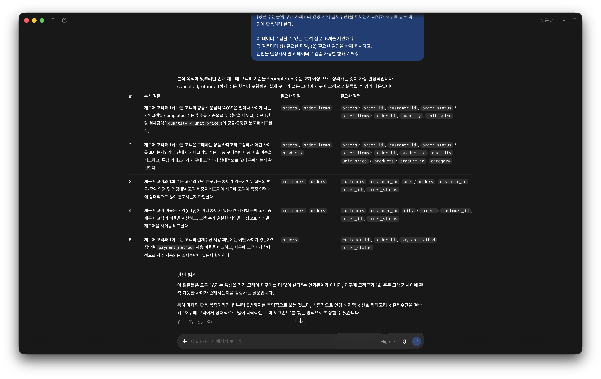
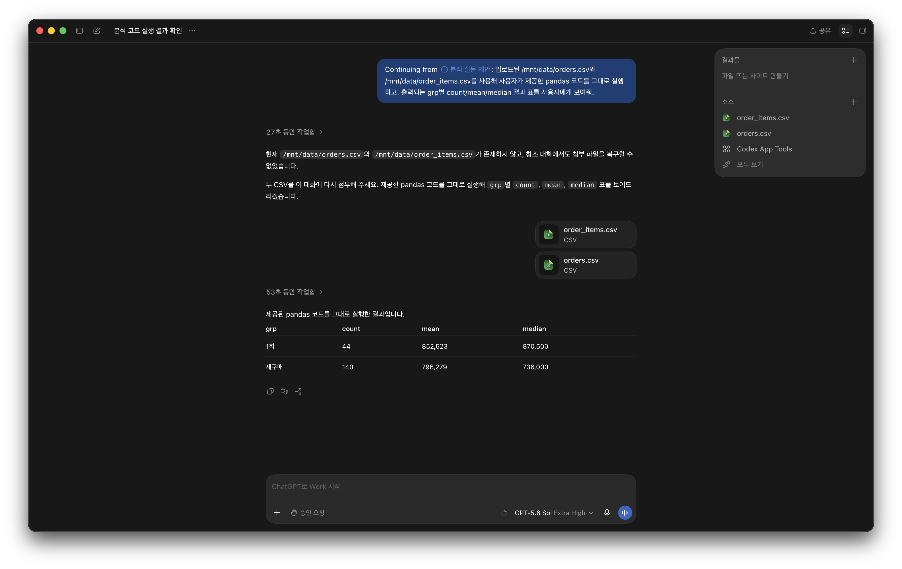

# Chapter 01 제출 답안. AI와 함께하는 데이터 분석의 시작

> 이 파일은 Chapter 01 실습 결과를 정리하여 제출하기 위한 학생용 템플릿입니다.  
> 강사 저장소의 원본 템플릿을 직접 수정하지 말고, 자신의 PC에 복사한 뒤 작성합니다.

---

## 0. 제출 정보

- 이름: 이진현 (Lee Jinhyeon)
- GitHub ID: lentok-viva
- 개인 저장소명: `llm-data-analysis-study`
- 작성일: 2026-09-13
- 사용한 LLM: ChatGPT

### 최종 제출 URL

```text
https://github.com/lentok-viva/llm-data-analysis-study/blob/main/chapter01/chapter01.md
```

---

## 1. 원래 업무 질문

### 내가 선택한 막연한 질문

```text
재구매 고객은 어떤 구매 행동 특성을 보이는가?
```

### 왜 이 질문이 모호하다고 생각했는가?

- 대상: 재구매 고객을 정확하게 정의하지 않음
- 기간: 명시하지 않음
- 기준: 구매 행동 특성에 대해 구체적으로 정의하지 않음
- 비교 방법: 비교군이 없음
- 분석 목적: 무엇에 사용할지 명확하지 않음

### 분석 가능한 질문으로 다시 작성

```text
전체 기간 동안 2회 이상 주문한 재구매 고객은 1회 주문한 고객과 비교해 평균 주문금액, 구매 카테고리, 연령, 지역, 결제수단에서 어떠한 차이를 보이는가?
```

### 결과 관찰

재구매 고객에 대해 정확하게 정의하고, 기간과 비교군을 명시하였다. 구매 행동 특성에 어떤 것이 포함될 수 있는지에 대해 나열하였다.

### 나의 해석과 판단

재구매 고객이 시기별로 다른 특성을 	보일 수 있고, 재구매 고객의 구매 행동 특성을 여러 변수로 쪼개어서 1회 구매 고객과의 비교 가능성을 제고하였다. 

### 업무·분석적 의미

한 명의 고객이 해당 서비스에서 2회 이상 구매하였다는 것은 이전의 구매 경험이 만족스러웠고, 해당 제품을 지속적으로 구매하는 것을 합리적이라고 느꼈다는 증거이다. 따라서, 어떠한 카테고리의 상품이 재구매할 만큼 만족스러웠는지, 재구매하는 경우에 주문 금액은 어느 정도인지, 해당 고객의 연령과 지역 등을 파악하는 것이 상품 라인 개선이나 플랫폼 UI 개선에 제언을 할 만큼 유의미한 결과를 산출할 것이라 기대한다.

### 한계와 추가 확인 사항

결과적인 재구매 행동이 갖고 있는 제품이나 서비스에 대한 만족도를 암시하는 상관관계가 강력하지 않을 수 있다. 즉, 재구매를 했다는 사실이 고객의 높은 만족도를 담보하지 않는 경우도 있다. 예를 들어, 제품이 재구매할 만큼 만족스럽지 않았으나 새로운 대안을 탐색하는 비용으로 인해 재구매를 선택하는 고객도 존재할 것이다. 또한 재구매를 한 고객보다 일회성으로 큰 금액을 주문한 고객이 이윤 창출에 더 큰 도움이 될 수 있다. 
더불어 재구매 고객이 해당 제품이나 서비스에 만족하는 경우에 입소문(Word of Mouth)이나 인터넷 후기(Word of Mouse) 등으로 이어져서 브랜드 마케팅에 추가적인 도움이 되었는지, 이를 유도하기 위해서 재구매 고객에 대한 어떠한 프로모션이 수반되는 것이 좋을지에 대해 추가로 확인할 수 있다.

---

## 2. 질문과 필요한 데이터 연결

### 필요한 데이터 파일

- [x] `customers.csv`
- [x] `products.csv`
- [x] `orders.csv`
- [x] `order_items.csv`

### 필요한 컬럼 후보

| 파일 | 필요한 컬럼 | 필요한 이유 |
| --- | --- | --- |
| customers.csv | customer_id, age, city | 고객 식별 및 연령·지역 특성 비교 |
| orders.csv | order_id, customer_id, order_date, payment_method, order_status | 고객별 재구매 여부, 결제수단, 기간, 주문 상태 필터 |
| order_items.csv | order_id, product_id, quantity, unit_price | 주문금액 계산 및 상품 연결 |
| products.csv | product_id, category | 제품 카테고리 및 특성 파악 |

### 데이터 연결 관계

```text
customers.customer_id  ->  orders.customer_id      (고객 1 : 주문 N)
orders.order_id        ->  order_items.order_id    (주문 1 : 상세 N)
products.product_id    ->  order_items.product_id  (상품 1 : 상세 N)

연결 흐름: customers -> orders -> order_items <- products
```

### 결과 관찰

재구매 질문에 답하는 데 필요한 지표(주문 횟수, 주문금액, 카테고리, 연령·지역, 결제수단)가 4개 파일에 나뉘어 있으며, customer_id·order_id·product_id를 기준으로 세 단계로 연결해야 한 고객의 재구매 행동을 파악할 수 있음을 확인했다.

### 나의 해석과 판단

재구매 여부는 orders를 customer_id로 묶어 주문 건수로 판정하고, 금액은 order_items에서 계산하며, 카테고리는 products에서 가져와야 하므로 세 테이블의 조인이 분석의 전제가 된다고 판단했다.

### 업무·분석적 의미

질문과 데이터 구조를 먼저 연결해두면, 실제 분석(집계·조인) 단계에서 무엇을 어떤 순서로 계산해야 하는지가 명확해져 불필요한 시행착오를 줄일 수 있다.

### 한계와 추가 확인 사항

실제 컬럼의 존재 여부·데이터 타입·결측 여부는 아직 직접 확인하지 않았고, 재구매 판정 시 cancelled·refunded 주문을 포함할지 결정하지 않았다. 이는 STEP 4에서 실제 데이터로 검증한다.

---

## 3. LLM에게 분석 질문 후보 요청

### 사용 목적

```text
구체화된 내 질문을 실제 데이터를 이용하여 검증하기 위해 LLM이 실제로 계산할 수 있는 질문 및 분석 요청으로 치환할 필요가 있었고, 동시에 내가 미처 생각하지 못했던 질문의 범위까지 확장하고자 하였다. 단, LLM의 제안은 실제 데이터로 검증하기 전에 초안으로만 사용할 예정이다.
```

### 사용한 Prompt

```text
나는 온라인 쇼핑몰 거래 데이터를 분석하려 한다. 데이터는 4개 CSV로 구성된다.

- customers(customer\_id, name, gender, age, city, signup\_date)
- products(product\_id, product\_name, category, price)
- orders(order\_id, customer\_id, order\_date, payment\_method, order\_status[completed/cancelled/refunded])
- order\_items(order\_item\_id, order\_id, product\_id, quantity, unit\_price)

분석 목적: 2회 이상 주문한 '재구매 고객'이 1회 주문 고객과 비교해 어떤 구매 행동 특성
(평균 주문금액·구매 카테고리·연령·지역·결제수단)을 보이는지 파악해 재구매 유도 마케팅에 활용하려 한다.

이 데이터로 답할 수 있는 '분석 질문' 5개를 제안해줘.
각 질문마다 (1) 필요한 파일, (2) 필요한 컬럼을 함께 제시하고,
원인을 단정하지 말고 데이터로 검증 가능한 형태로 써줘.
```

### LLM 답변 요약

LLM의 전체 답변을 그대로 복사하지 말고 핵심 제안 3~5개를 요약하세요.

1. 재구매 고객과 1회 주문 고객의 평균 주문금액(AOV)은 얼마나 차이가 나는가? 고객별 completed 주문 횟수를 기준으로 두 집단을 나누고, 주문 1건당 결제금액(quantity × unit_price)의 평균·중앙값·분포를 비교한다.
2. 재구매 고객과 1회 주문 고객은 구매하는 상품 카테고리 구성에서 어떤 차이를 보이는가? 각 집단에서 카테고리별 주문 비중·구매수량 비중·매출 비중을 비교하고, 특정 카테고리가 재구매 고객에게 상대적으로 많이 구매되는지 확인한다.
3. 재구매 고객과 1회 주문 고객의 연령 분포에는 차이가 있는가? 두 집단의 평균·중앙 연령 및 연령대별 고객 비중을 비교하여 재구매 고객이 특정 연령대에 상대적으로 많이 분포하는지 확인한다.
4. 재구매 고객 비율은 지역(city)에 따라 차이가 있는가? 지역별 구매 고객 중 재구매 고객의 비율을 계산하고, 고객 수가 충분한 지역을 대상으로 지역별 재구매율 차이를 비교한다.
5. 재구매 고객과 1회 주문 고객의 결제수단 사용 패턴에는 어떤 차이가 있는가? 집단별 payment_method 사용 비율을 비교하고, 재구매 고객에게 상대적으로 자주 사용되는 결제수단이 있는지 확인한다.

### 결과 관찰

재구매 고객과 1회 주문 고객 간의 수치적인 비교를 중심으로 질문을 제안하였다. 또한 각 제안이 필요한 파일과 컬럼을 동시에 제시하였다.

### 나의 해석과 판단

평균이나 중앙값, 분포 등 변수의 통계치를 확인하여 이들을 비교하려고 한 점이 인상적이었다. 특히, 지역별 재구매율을 고려할 때에 고객 수가 충분한 지역으로 한정하여 표본 규모에 따른 통계적 유의성까지 고려하는 것이 효과적인 분석에 도움이 될 것이라 판단하였다. 하지만 LLM이 데이터의 실제 구조를 인지한 후에 제안한 것이 아니라는 점에서 부분적으로 한계가 존재하였다. 예를 들어, '주문 1건당 결제금액'은 추가적으로 새로운 컬럼으로 가공하여 추가하여야 하는 정보였다.

### 업무·분석적 의미

LLM이 빅데이터를 빠르게 분석하여 이에 대한 대략적인 이해를 돕고, 발상을 확장하며, 인간이 놓친 관점 등에 대해 제시해줄 수 있다고 생각한다. 하지만, 데이터를 검증하고, 이에 대한 최종적인 판단을 하는 영역은 LLM이 인간을 대체하기 어렵다고 생각한다.

### 한계와 추가 확인 사항

필요 컬럼은 모두 실재하고 결측도 없음을 확인했다. 다만 결제금액 컬럼이 원본에 없어 quantity×unit_price로 가공해야 하며, 이는 order_items의 상품 라인 단위 금액이므로 주문 단위·고객 단위 금액은 order_id·customer_id로 합산해야 한다. 또 order_date는 문자열이라 기간 분석 시 날짜 변환이 필요하다.

### Evidence



---

## 4. LLM 제안 검증

LLM 제안 중 하나 이상을 선택해 검토합니다.

| 검증 항목 | 확인 내용 |
| --- | --- |
| 선택한 LLM 제안 | #1 재구매 고객과 1회 주문 고객의 평균 주문금액(AOV) 비교 |
| 필요한 파일 | orders, order_items |
| 필요한 컬럼 | order_id, customer_id, order_status, quantity, unit_price |
| 계산 범위 | order_status=completed만 사용. 재구매 = completed 주문 2회 이상 |
| 실제 데이터 확인 필요 여부 | 확인함 — 결제금액 컬럼이 없어 `quantity×unit_price`를 order_id로 합산해 주문금액을 파생 |
| 원인 단정 여부 | 없음 (집단 간 차이의 존재 여부만 확인) |
| 최종 판단 | 수정 후 사용 |

### 내가 수정한 내용

```text
LLM은 '주문 1건당 결제금액'이라고 표현했으나, order_items는 상품 라인 단위이므로
order_id로 quantity×unit_price를 합산해 '주문 단위 금액'을 만들었다.
또한 재구매 고객을 completed 주문 2회 이상으로 조작적 정의하고, cancelled·refunded 주문은 제외했다.
```

### 결과 관찰

completed 주문 184건 기준으로 재구매 고객 56명, 1회 주문 고객 44명이었다. 주문 단위 결제금액의 평균은 재구매 796,279원 < 1회 852,523원, 중앙값은 재구매 736,000원 < 1회 870,500원으로, 재구매 고객의 건당 결제금액이 오히려 더 낮게 나타났다.

### 나의 해석과 판단

LLM 제안은 재구매 고객이 더 큰 금액을 지출할 것이라는 가정을 암묵적으로 깔고 있었으나, 실제 데이터에서는 반대의 결과가 나타났다. 재구매 고객의 가치는 건당 결제금액이 아니라 구매 빈도와 누적 총액에서 나올 수 있으므로, AOV 하나만으로 재구매 고객의 가치를 판단하면 오해할 수 있다고 판단했다. 따라서 이 제안을 그대로 사용하지 않고, 누적 총구매액·구매 빈도 지표를 함께 보도록 수정해 사용한다.

### 업무·분석적 의미

재구매 고객을 겨냥한 마케팅을 설계할 때, '재구매 고객은 객단가가 높다'는 통념에 근거해 고가 상품을 제안하는 전략은 이 데이터에서는 뒷받침되지 않는다. 오히려 반복 구매를 유도하는 빈도 중심 전략(적립·재구매 쿠폰 등)이 더 타당할 수 있다.

### 한계와 추가 확인 사항

표본이 작아(재구매 56명·1회 44명) 두 집단 평균 차이의 통계적 유의성은 아직 검증하지 않았다. 재구매 고객의 가치를 제대로 평가하려면 누적 총구매액과 구매 빈도까지 함께 분석해야 한다.

### Evidence



---

## 5. Prompt Log

- 사용 목적: 재구매 분석 질문을 데이터로 검증 가능한 형태로 확장하고, 내가 놓친 분석 관점을 보완하기 위해 LLM에 질문 후보를 요청.
- 입력 Prompt 요약: 4개 CSV의 구조(파일·컬럼)와 "재구매 고객 vs 1회 고객의 구매 행동 특성 비교"라는 분석 목적을 제시하고, 데이터로 검증 가능한 분석 질문 5개와 각 질문의 필요 파일·컬럼을 요청.
- LLM 답변 요약: 평균 주문금액(AOV)·카테고리·연령·지역·결제수단 5개 축에서 재구매 vs 1회 고객을 비교하는 질문을 제안했고, 재구매를 completed 주문 2회 이상으로 정의할 것을 함께 제시.
- 실제 반영 여부: #1(AOV 비교) 제안을 STEP 4 검증에 채택. 나머지(#2~#5)는 후속 분석 후보로 보류.
- 사람이 검증한 항목: 필요 컬럼의 실재·결측 여부(결측 없음), 결제금액 컬럼 부재로 인한 파생 필요, 주문 단위 금액의 order_id 합산 필요, completed 필터 적용, 실제 AOV 집단 비교 계산 수행.
- 사람이 수정한 내용: LLM의 '주문 1건당 결제금액'을 order_id로 합산한 '주문 단위 금액'으로 재정의하고, 재구매 기준을 completed 2회 이상으로 확정.
- 남은 확인 사항: 두 집단 평균 차이의 통계적 유의성, 누적 총구매액·구매 빈도 지표를 결합한 재구매 고객 가치 평가.

### 결과 관찰

LLM은 분석 질문의 방향(어떤 축으로 비교할지)을 빠르게 제시했으나, 실제 데이터 구조에 맞춘 금액 파생·주문 단위 합산·집단 정의는 사람이 직접 보완해야 했다.

### 나의 해석과 판단

LLM은 분석 초기의 발상 확장과 초안 작성에는 효과적이지만, 데이터 구조에 대한 정확한 검증과 지표의 조작적 정의, 결과에 대한 최종 판단은 사람이 책임져야 하는 영역이라고 판단했다. Prompt Log를 남기면 어떤 제안을 왜 채택·수정·보류했는지 의사결정 과정을 추적할 수 있어, 분석의 재현성과 책임 소재가 분명해진다.

## 6. 개인정보와 Secret 보호 확인

다음 항목을 확인합니다.

- [x] 실제 이름·이메일·전화번호 등 고객 개인정보를 Prompt에 사용하지 않았습니다. (Prompt에는 컬럼 구조만 제시)
- [x] API Key를 코드나 Notebook에 직접 작성하지 않았습니다.
- [x] `.env` 실제 내용을 캡처하거나 업로드하지 않았습니다. (`.env`에는 예시 문자열만 사용)
- [x] GitHub Token, 비밀번호, 내부 URL이 캡처에 보이지 않습니다.
- [x] 제출 전 이미지까지 다시 확인했습니다.

### 나의 판단

이번 실습에서 고객 이름(customers.csv의 `name`)과 `.env`의 실제 API 키는 LLM이나 Public GitHub에 올리면 안 되는 정보라고 판단했다. 그래서 STEP 4 검증을 위해 LLM에 파일을 올릴 때도 이름이 없는 `orders.csv`, `order_items.csv`만 사용했고, 개인정보가 포함된 `customers.csv`는 업로드하지 않았다.

## 7. Chapter 01 Notebook 확인

Notebook:

```text
notebooks/ch01_ai_data_analysis_intro.ipynb
```

### 내 환경 상태

- [x] 아직 환경설정이 완료되지 않아 Notebook 위치만 확인했습니다.
- [ ] 환경설정이 완료되어 Notebook을 직접 실행했습니다.

### 미실행 이유와 대체 수행

로컬 Anaconda 환경의 수치 라이브러리(MKL, `libmkl_core.1.dylib`) 오류로 pandas import가 실패해 강사 제공 Notebook을 직접 실행하지 못했다. 다만 실습을 건너뛰지 않기 위해, STEP 4의 재구매 vs 1회 고객 AOV 검증은 동일한 pandas 코드를 ChatGPT의 코드 실행 기능으로 수행해 결과를 확인했다(해당 결과는 STEP 4 참조).

### Chapter 02 실행 계획

Chapter 02의 실습 환경 구축 단계에서 Anaconda 환경을 재정비하거나 별도 가상환경(venv)에 pandas를 재설치해 MKL 오류를 해결하고, `ch01_ai_data_analysis_intro.ipynb`를 로컬에서 직접 실행해 데이터 로드와 `.head()` 결과를 확인할 예정이다.

## 8. Chapter 01 최종 해석

### 이번 장에서 가장 중요하다고 생각한 내용

데이터 분석은 코드 실행이 아니라 좋은 질문을 정의하는 데서 시작한다는 점이 가장 중요했다. 막연한 "재구매 고객의 특성"을 측정 가능한 지표와 비교군으로 구체화해야 비로소 데이터로 답할 수 있었다. 또한 LLM은 분석 질문의 방향을 넓혀 주었지만 실제 데이터 구조는 사람이 검증해야 했고, 무엇보다 "재구매 고객이 더 큰 금액을 쓸 것"이라는 통념이 실제 데이터에서는 반박되었다. 이를 통해 코드가 오류 없이 실행되었다는 사실과 분석이 유의미한 결론에 도달했다는 것은 다르다는 점을 확인했다.

### LLM을 데이터 분석에 사용할 때 가장 조심해야 할 점

LLM은 실제 데이터 구조를 모른 채도 그럴듯한 제안을 하므로(예: 원본에 없는 결제금액 컬럼을 가정, 재구매 정의를 임의 설정), 제안을 그대로 신뢰하지 말고 컬럼의 실재·타입·결측과 계산 범위, 지표의 정의를 사람이 직접 검증한 뒤 사용해야 한다. 결과에 대한 원인 단정도 경계해야 한다.

### 사람과 LLM의 역할 차이

| 항목 | LLM이 도울 수 있는 부분 | 사람이 책임져야 하는 부분 |
| --- | --- | --- |
| 질문 정의 | 다양한 분석 질문 후보와 비교 관점 제시 | 분석 목적에 맞는 질문 선택과 조작적 정의 |
| 데이터 확인 | 필요한 파일·컬럼 후보 제안 | 컬럼 실재·타입·결측·파생 필요 여부 검증 |
| 코드 작성 | 집계·비교 코드 초안 생성 | 코드 실행과 정확성·계산 범위 확인 |
| 결과 해석 | 결과에 대한 가능한 해석 제시 | 통념과 다른 결과의 타당성 판단 |
| 최종 판단 | 판단 근거 정리 보조 | 채택·수정·보류의 최종 결정과 책임 |

### 다음 Chapter에서 확인하고 싶은 것

환경 오류를 해결해 강사 Notebook을 직접 실행해 보고, 재구매 고객의 가치를 건당 금액이 아니라 누적 총구매액과 구매 빈도로 재분석하고 싶다. 또한 두 집단의 금액 차이가 통계적으로 유의한지 검정해 보고 싶다.

## 9. 최종 제출 체크리스트

- [x] 원래 업무 질문과 구체화한 분석 질문을 작성했습니다.
- [x] 질문에 필요한 데이터 파일과 컬럼 후보를 정리했습니다.
- [x] LLM Prompt와 답변 요약을 작성했습니다.
- [x] LLM 제안을 실제 데이터 관점에서 검증했습니다.
- [x] 각 핵심 STEP의 결과 관찰을 작성했습니다.
- [x] 각 핵심 STEP의 나의 해석과 판단을 작성했습니다.
- [x] 업무·분석적 의미를 작성했습니다.
- [x] 한계와 추가 확인 사항을 작성했습니다.
- [x] 핵심 실행 Evidence 이미지를 첨부했습니다.
- [x] 이미지가 Markdown에서 정상 표시됩니다.
- [x] 개인정보가 없습니다.
- [x] API Key·Secret·Token이 없습니다.
- [x] 개인 GitHub 저장소에 업로드했습니다.
- [x] GitHub에서 Markdown과 이미지가 정상 표시됩니다.
- [x] 아래 최종 파일 URL이 정상적으로 열립니다.

### 최종 파일 URL

```text
https://github.com/lentok-viva/llm-data-analysis-study/blob/main/chapter01/chapter01.md
```

## 10. 교수자 확인용 요약

### 수행 상태

- [x] COMPLETE
- [ ] PARTIAL

### 내가 가장 중요하게 내린 판단 1개

```text
재구매 고객이 1회 주문 고객보다 건당 결제금액이 오히려 낮게 나타나, 통념과 달리
평균 주문금액(AOV) 하나만으로는 재구매 고객의 가치를 판단할 수 없다고 판단했다.
```

### 아직 확인이 필요한 내용 1개

```text
재구매 고객의 실제 가치를 평가하려면 건당 금액이 아니라 누적 총구매액과
구매 빈도까지 함께 분석해야 하며, 두 집단의 금액 차이가 통계적으로 유의한지도 검정이 필요하다.
```
